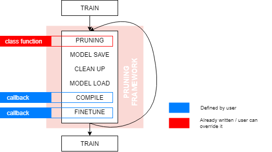

# Ridurre - Filter Pruning in Deep Convolutional Networks

Pruning is the process when we try to shrink a network by removing the not so significant/redundant filters.

This package is a mini-framework which you can easily use on your existing models and also you can define your own
pruning methods without any struggle.




## Install

`pip install ridurre`

- Install packages inside `requirements.txt`
    - `pip install -r requirements.txt`

## Usage

### Define you own pruning method

You can make your own pruning method by creating a new class which has the parent `BasePruning`. There is only 1 thing
you should take care and that the implementation of the `run_pruning_for_conv2d_layer` function.

For an example just take a look at the [`RandomFilterPruning`](/ridurre/random_pruning.py) code.

### Use an already existing method

Check out the [`example/model_pruning_example.py`](/example/model_pruning_example.py) for a simple but
extensive tutorial

#### Callbacks

You will need to define 2 callbacks for the pruning:

- **Model compile function**
    - 1 argument:
        - `model` which is a `keras.models.Model`
    - This should define how to compile the model
    - Example:
        ```python
        def compile_model(my_model):
            my_model.compile(optimizer=optimizers.Adam(lr=0.001),
                             loss=losses.categorical_crossentropy,
                             metrics=["accuracy"])
        ```
- **Finetune function**
    - 3 arguments:
        - `model` which is a `keras.models.Model`
        - `initial_epoch` which is an `int`: This defines the initial epoch state for the model fitting.
        For example it is 12 if we trained the model for 12 epochs before this function was called
        - `finetune_epochs` which is an `int`: Defines how much should we train after a pruning.
    - This should define how to finetune out model
    - Example:
        ```python
        def finetune_model(my_model, initial_epoch, finetune_epochs):
                my_model.fit(x_train,
                             y_train,
                             32,
                             epochs=finetune_epochs,
                             validation_data=(x_test, y_test),
                             callbacks=callbacks,
                             initial_epoch=initial_epoch,
                             verbose=1)
        ```

#### Pruning

You will need to select which pruning method you would like to use. In this example I will use the KMeans pruning

```python
import ridurre

# Create the model
model = build_model(...)

# Define compile callback
def compile_my_model(model):
    model.compile(...)

# Compile with your callback (of course you can use different compilation for this train and the pruning)
compile_my_model(model)

# Train if you would like to start from a better position
model.fit(...)

# Define finetuning callback
def finetune_my_model(model, initial_epoch, finetune_epochs):
    model.fit(..., epochs=finetune_epochs, initial_epoch=initial_epoch)

# We can start pruning
pruning = ridurre.KMeansFilterPruning(0.9,
                                             compile_my_model,
                                             finetune_my_model,
                                             6,
                                             maximum_pruning_percent=0.4,
                                             maximum_prune_iterations=12)
model, _ = pruning.run_pruning(model)
```

At the end of the pruning step, you will have a trained and pruned model which you can use.
I can recommend to train your model after the pruning for just a little longer as an extra step towards accuracy.

## Future work

- Look for problematic cases, where there is a merging (like `add`) and warn the user that the different inputs to that
operations should be pruned in the same manner
    - A good example for a case like this is *ResNet*
- Define "pruneable" set of layers
    - With regex or layer indices
    - This needs to find `add`, `multiply`, `average`, etc... operations (layers) which needs same filter number
    from the different inputs
- Different pruning factors for channels with different number of filters
- More pruning solutions
- Do not depend on kerassurgeon as I only use the channel delete function

## Papers

*[1]* [Filter Level Pruning Based on Similar Feature Extraction for
Convolutional Neural Networks](https://www.jstage.jst.go.jp/article/transinf/E101.D/4/E101.D_2017EDL8248/_pdf)

*[2]* [Demystifying Neural Network Filter Pruning](https://openreview.net/pdf?id=rJffBWBtoX)
